**Interpretable and Efficient Heterogeneous Graph Convolutional Network**

论文链接：https://ieeexplore.ieee.org/abstract/document/9508875

### **摘要**

图卷积网络(GCN)在学习图形中节点的有效任务特定表示方面取得了非凡的成功。然而，对于异构信息网络(HIN)，现有的面向HIN的GCN方法仍然存在两个不足:

(1)不能灵活地探索所有可能的元路径，并提取出目标对象中最有用的元路径，从而影响了有效性和可解释性;
(2)通常需要生成基于中间元路径的稠密图，计算复杂度较高。
为了解决上述问题，本文提出了一种可解释的高效异构图卷积网络(ie-HGCN)来学习HIN中的对象表示。它被设计为分层聚合体系结构，即首先是对象级聚合，然后是类型级聚合。新的体系结构可以自动从所有可能的元路径中(在一定长度范围内)提取出每个对象的有用元路径，从而带来良好的模型可解释性。通过避免中间HIN变换和邻域注意力，还可以降低计算代价。本文从评估所有可能的元路径的有用性、它与HINs上的谱图卷积的联系以及它的准线性时间复杂度等方面对所提出的ie-HGCN进行了理论分析。在三个真实的网络数据集上的大量实验表明，ie-HGCN比目前最先进的方法优越。

### 创新点
1）可解释性：本文提出的对象级聚合和类型级聚合定义了每一层中每个对象邻域的选择概率分布。通过堆叠多个层，聚合方案有助于自适应地学习每个对象的每个元路径的概率重要性分数，这确保了元路径的“个性化”有用性评估并增强了模型的可解释性。 2) 效率： ie-HGCN 随着多层迭代计算的进行评估各种元路径。因此，它避免了计算非常耗时的基于元路径的图。此外，ie-HGCN 在每一层中首先使用行归一化邻接矩阵将目标对象的各个类型的邻居聚合为“类型”对象，然后使用类型级注意聚合它们。这种分层聚合架构也使模型变得高效，因为：（1）它避免了在目标对象附近进行大规模的 softmax 计算； (2) HIN 通常只有少量的对象类型，这导致注意力计算非常有效。

### 模型
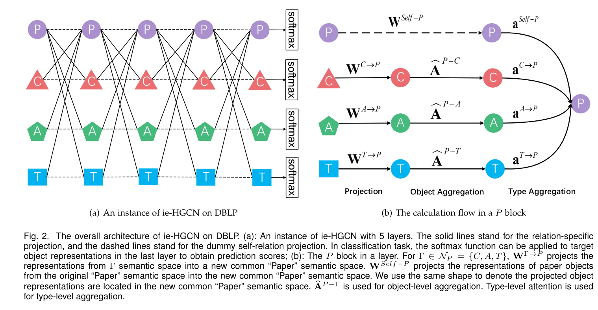
上图显示了在DBLP上ie-HGCN模型的总体架构。每层包含|A|个块，在每个块中，执行三个关键计算步骤。

##### 第一步： 映射

对于不同类型的对象，其特征位于不同的语义空间中。为了使这些不同类型的对象特征具有可比性，在每个块中，我们首先将不同类型的邻居对象的表示投射到一个新的公共语义空间中。
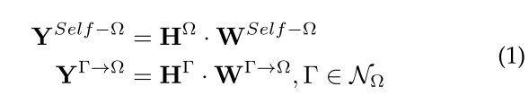
Ω的邻接的节点类型对应的特征分别求出来，为当前的节点类型，也要做一次自投影

##### 第二步：对象级聚合
在将邻居对象的所有隐藏表示投影到一个公共语义空间后，执行对象级聚合。然而不能直接将GCN[31]应用到聚合中，因为一个对象的邻居在HINs中是不同类型的，即HINs的异构性。两个不同类型的对象之间的邻接矩阵甚至可能不是方阵
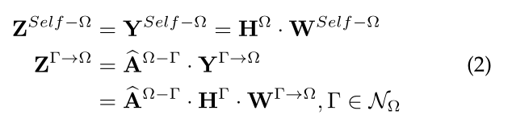

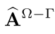代表类型为Ω-Γ类型的邻接矩阵，这里表示将Ω的邻接节点类型对应的Γ类型节点的特征收集起来，会得到如下的特征，对应邻接的多种类型到Ω类型的收集到的特征
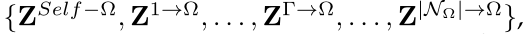

另一种设计选择是采用类似于[25]中的对象级聚合的注意机制。然而，我们仍然坚持使用 由于以下原因：首先，(加权的)邻接矩阵可以为类型内聚合(即对象级聚合)提供足够好的权值。直观地说，在参考书目图表中，作者所写的论文同样有助于他/她的专业知识;在社交活动图表中，用户访问网店的次数自然代表了他/她对网店的偏好程度。其次，对象级注意在计算上效率低下，因为在现实世界的复杂网络中，对象可能有大量的邻居，这导致注意机制[26]中softmax的计算效率低下。通过避免在较大的邻居中计算softmax，可以进一步提高ie-HGCN的效率

##### 第三步：类型级映射

为了学习更全面的表示Ω，我们需要融合来自不同类型邻居对象的表示。对于目标对象，来自不同类型邻居对象的信息可能会对特定任务产生不同的影响。以DBLP中的纸质对象为例。在预测论文质量的任务中，论文发表地点的会议代表可能更重要。为此，我们提出了类型级注意力，自动学习不同类型的邻居对象的重要权重，并相应地聚合上一步对应的卷积表示。这里利用了注意力机制求权重，即Ω类型邻接的多种邻接类型不是同等重要。
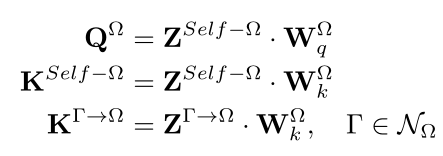
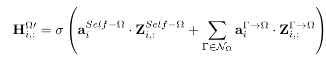
则Hi为所求的聚合后的i的特征表示。一旦从最后一层获得对象的最终表示，它们就可以用于各种任务，如分类、聚类等。损失函数可以根据具体的任务来定义。对于半监督多类对象分类，可以定义为每个对象类型下所有被标记对象的交叉熵之和(或加权之和):

### 实验部分

##### 数据集
IMDB.   4 种节点类型的 HIN：Movie (M)、Author演员 (A)、User (U) 和Director (D)，M — A, M — U 和M — D.—代表双向的关系。
ACM.    3 种节点类型构造一个 HIN：Paper (P)、Author (A) 和Subject (S)，关系为 P —A   和 P —S. 
DBLP.   4种节点类型Paper（P），Author （A），会议（C）和（T），关系为P —A, P —C 和 P — T 
作者 (A) 对象根据他们发表论文的会议被标记为四个研究领域 （数据挖掘、数据库、人工智能、信息检索）。

##### 节点分类任务

##### ie-HGCN 对比 ie-HGCN mean
ie-HGCNmean——它是 ie-HGCN 的变体。用mean 函数替换了类型级别的注意力。我们使用这种方法来展示类型级注意力的有效性

在每个数据集上，随机选择 x% 的对象作为训练集，其余的 (1-x)% 均分为验证集和测试集，其中 x ∈ {20, 40, 60, 80}。**本文的任务是在DBLP数据集上，以Author类型的节点为目标对象，嵌入向量用来计算Author属于哪一个研究领域的作者，是一个多分类任务。**

HGCN模型的层数设置为 5。第一层是输入层，不同对象的维数由对象特征决定。对于其他 4 个隐藏层，维度都设置为 [64, 32, 16, 8]。非线性 激活函数 设置为 ELU 函数 。类型级注意力的隐藏层维度 da 设置为 64。为了优化，学习率为 0.01。我们对除输出层之外的每一层的输出应用 dropout，dropout 率为 0.5。 l2 正则化权重设置为 5e-4。为了公平比较，我们的 ie-HGCN 和 ie-HGCNmean 使用相同的超参数设置。
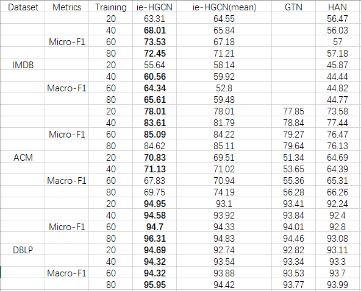

由于GTN的空间复杂度很高，在IMDB上内存不够。HGCN对比 HGCN-mean、HAN、GTN实现了整体的最佳性能，并且HGCN 的效果要好于HGCN-mean算法，尤其在DBLP数据集上，不管我们的数据训练集比例设为多少，带注意力机制的HGCN都要好于HGCN-mean模型。表明：**类型级注意力可以发现和利用最有用的元路径来完成这项任务的有效性。**
		GTN 的表现不如 ie-HGCN，其原因应该是它不够灵活，无法捕捉不同对象的复杂性。而HAN不如HGCN，是因为HGCN可以自动发现长度限制内所有的元路径，捕捉的信息更为全面。

##### 算法可解释性实验
 HGCN的一个显著特点是能够评估所有可能的元路径，发现和利用对特定任务最有用的元路径。首先，展示了全局意义上最有用的元路径，它们是由 ie-HGCN 发现的，用于对 DBLP 中的**Author（A）节点**进行分类任务。
 
 
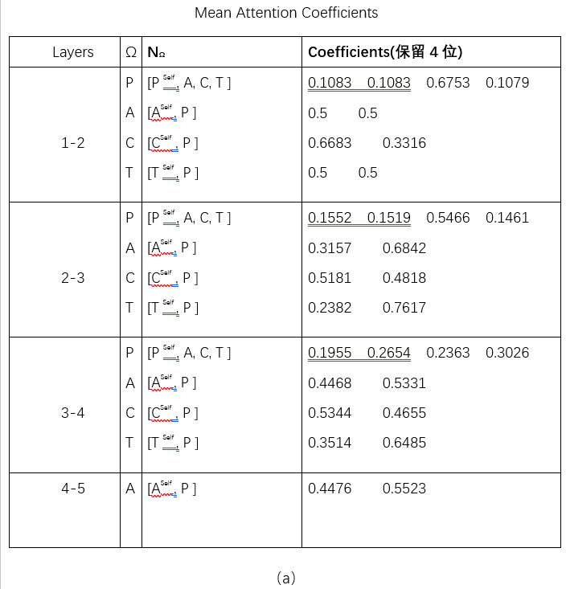

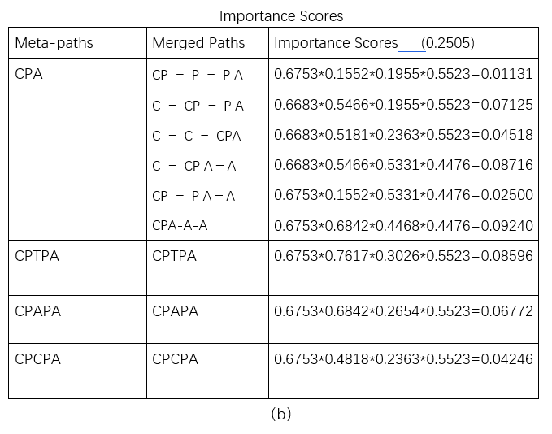

首先计算每个块中的平均注意力分布。（a）然后根据这些平均分布计算元路径的重要性分数。(b) 显示了计算细节。在这里需要合并代表相同元路径的等效路径。对于对象类型Ω，我们用Ω-Ω表示虚拟自关系，用ΩΩ表示真实自关系。因此，表 (b) 中的 top-6 路径都等价于 CP A。**CP A 的重要性得分是 top-6 路径的得分之和，即 0.2505（最大***）。它表明 CP A 是作者对象分类任务最有用的元路径，CPA的语义是“==作者发表论文的会议 #F44336==”

在DBLP数据集中，作者（即他/她的研究领域）可以根据他/她发表论文的会议进行标记。此外，==CP AP A #8BC34A== 和 ==CP T P A #8BC34A== 也可用于该任务。 ==CP AP A #8BC34A== 表示，除了作者本人发表论文的会议外，他/她的共同作者发表论文的会议也有用。 ==CP T P A #8BC34A== 建议我们应该进一步考虑那些发表的论文与作者所写的论文有很多共同术语的会议。注意一篇论文只能在一个会议上发表。元路径==CP C #8BC34A== 本质上不向会议引入其他会议的信息。因此，我们可以将 ==CP CP A #8BC34A== 解释为 ==CP A #8BC34A==。

 ie-HGCN 在 ACM 上发现了 ==P SP #8BC34A== 和 ==P AP #8BC34A== 的有用元路径，在 IMDB 上发现了 ==M U M、M AM #8BC34A== 和 ==U M #8BC34A== 的有用元路径，用于它们各自的分类任务。
 
 
 

##### 隐藏层扩展
对于ie-HGCN，层数越多，可以捕捉到的语义越复杂丰富。我们实现了 8 个 ieHGCN 实例，层数从 2 增加到 9。具体来说，固定其他超参数，我们将这些模型实例的层（输入层除外）维度设置为：[64]、[64、32]、[ 64, 32, 16], [64, 32, 16, 8], [64, 64, 32, 16, 8], [64, 64, 64, 32, 16, 8], [64, 64, 64, 64, 32, 16, 8], [64, 64, 64, 64, 64, 32, 16, 8]

在 DBLP 上测试了它们的分类性能。每个模型实例随机运行 10 次，平均 Micro F1 和 Macro F1 分数在下表中。可以看到，当模型有 2 层时，性能很差。 2 层的 ie-HGCN 模型只能考虑长度小于 2 的元路径。如第 5.5 节所述，为了在 DBLP 上准确分类作者对象，捕获和融合来自相关会议对象的信息。然而，在 DBLP 的网络模式中，作者和会议之间没有 1 跳元路径（图 1）。当深度为 3 时，性能大幅提升，因为 ie-HGCN 可以利用元路径 CP A。然后，随着深度的增加，性能略有增长，直到深度为 8 时达到最佳状态。当层数为9时性能开始下降，可能是由于过度拟合。
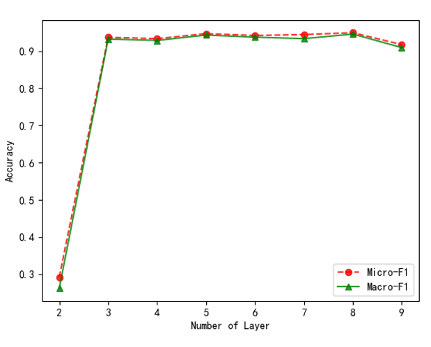

##### 超参数研究
在本小节中，我们研究了 ieHGCN 的性能对类型级注意力层维度的敏感性。在其他超参数固定的情况下，我们逐渐将 注意力维度 从 8 增加到 512，并在下图中记录Micro F1 和 Macro F1。可以看到在 DBLP 数据集上，性能对维度（da）的大小不是很敏感。在 IMDB 和 ACM 上，Micro F1 不是很敏感，而 Macro F1 更敏感。考虑到 Macro F1 对分类中的倾斜类敏感，这可以解释为 IMDB 和 ACM 中的类是倾斜的，而 DBLP 中的类是平衡的。大体模式是：一开始，随着维度的逐渐增加，性能增长；然后性能开始下降，这应该是由于注意力模块中的参数过多造成的。整体拐点在 64 维。因此，我们为 ie-HGCN 设置 da = 64。
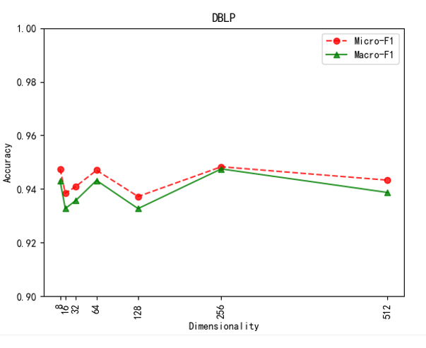

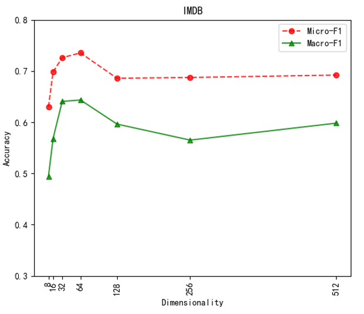
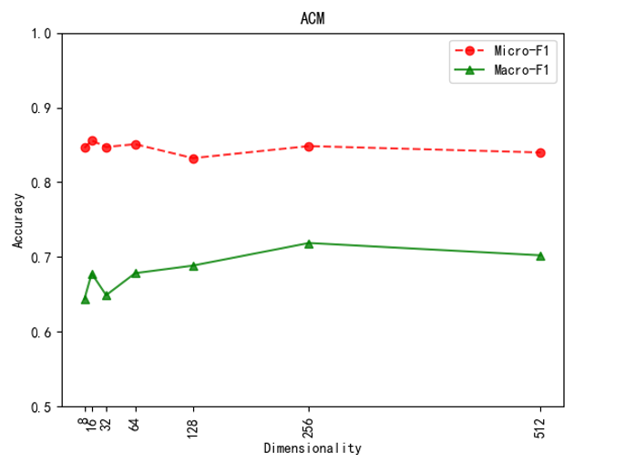

### 思考

在异质图网络上进行表征学习，本文不需要指定元路径，也不需要根据元路径在新的子图上进行大量计算，
1）利用尽可能多的元路径，增加信息提取的广度；利用尽可能长的元路径，能包含更加丰富的语义 ，这个模型可以根据网络隐藏层的深度进行元路径长度的扩展，同时发现所有的元路径。 
2）避免指定元路径进行表征，指定元路径需要一定的先验知识，还会生成新的图，引入的计算量比较大 
3）引入注意力机机制，表征出不同元路径对特定任务的重要性，甚至在元路径内部 （即一条元路径中间的节点也包含了信息，需要关注，同时这些中间节点对于这条元路径代表的语义所代表的重要性也不近相同）

